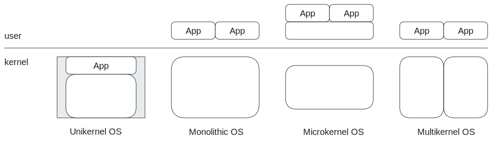
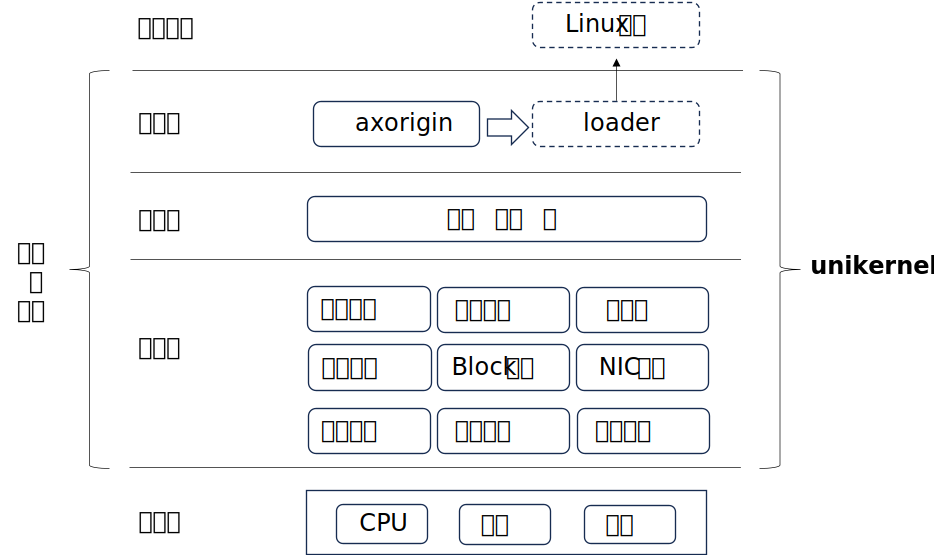

## 第五节 Unikernel 与组件化概念

ArceOS 是基于组件化思想的，从 Unikernel 形态起步的操作系统。

在本章结束之前，我们就来讨论一下 Unikernel 与组件化这两个基本的概念。为我们后面的工作建立一个基础。

### **Unikernel**

Unikernel 是操作系统内核设计的一种架构（或称形态），从下图对比可以看出它与其它内核架构的显著区别：

   

Unikernel 相对其它内核架构有三个特点：

1. 单特权级：应用与内核都处于同一特权级 - 即内核态，这使得应用在访问内核时，不需要特权级的切换。
2. 单地址空间：应用没有单独的地址空间，而是共享内核的地址空间，所以在运行中，也不存在应用与内核地址空间切换的问题。
3. 单应用：整个操作系统有且仅有一个应用，所以没有多应用之间隔离、共享及切换的问题。

所以相对于其它内核架构，Unikernel 设计实现的复杂度更低，运行效率相对较高，但在安全隔离方面，它的能力最弱。Unikernel 有它适合的特定的应用领域和场景。

ArceOS 选择 Unikernel 作为起步，希望为将来支持其它的内核架构建立基础。本实验指导正是对应这一阶段，从零开始一步一步的构建 Unikernel 形态的操作系统。Unikernel 本身这种简化的设计，可以让我们暂时忽略那些复杂的方面，把精力集中到最核心的问题上。

### **组件化操作系统**

组件是预构建的、可以复用的、封装特定功能的独立实体。组件的内部功能对外不可见，外部只能通过它公开的接口与之通信。

现在我们把组件化思想应用到操作系统的构建实践中，组件是构造操作系统的最基本元素（Building Block），参与操作系统构建的所有功能部件，包括底层的系统引导与硬件封装，中层的各种子系统核心功能，上层的驱动以及服务，甚至内嵌到 Unikernel 中的应用，全部都是组件。

构建操作系统的过程大致可以分为两步：第一步是基于经验与实践，不断提炼组件，以建立基本的组件仓库；第二步是从仓库中选择适当的组件以适当的方式进行组合，形成目标操作系统。在我们的实验中，这两步是不断重复，反复迭代的过程。

在 Rust 开发中，组件 $\approx$ crate，在之后的内核开发实验中，将以构建 crate 的方式来构建组件，并将主要通过 dependencies+features 的方式组合组件，构造目标系统。

当本实验指导书的所有实验完成后，会形成如下图所示的组件化的操作系统：

   

